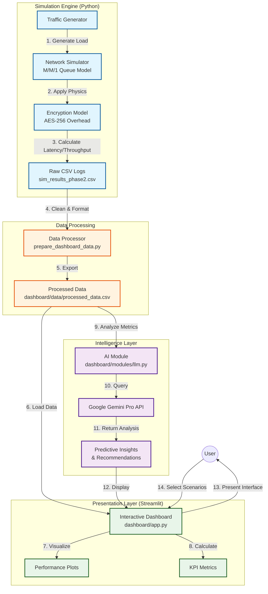

# Project Architecture Diagram

This diagram illustrates the end-to-end flow of the SAN Optimization Project, from the mathematical simulation engine to the user-facing dashboard.

## Component Breakdown

1.  **Simulation Engine**:
    *   Generates synthetic traffic patterns (Low, Medium, High, Spikes).
    *   Simulates network physics using M/M/1 queuing theory.
    *   Applies the AES-256 encryption model (CPU cost + packet overhead).

2.  **Data Processing**:
    *   Ingests raw simulation logs.
    *   Standardizes column names and calculates derived metrics (e.g., Utilization).
    *   Prepares data for the dashboard.

3.  **Intelligence Layer**:
    *   Monitors performance metrics in real-time.
    *   Sends context to Google Gemini Pro.
    *   Returns human-readable predictions and backup scheduling recommendations.

4.  **Presentation Layer**:
    *   **Streamlit Dashboard**: The central control plane.
    *   Visualizes throughput, latency, and encryption impact.
    *   Displays AI-generated insights to the user.
