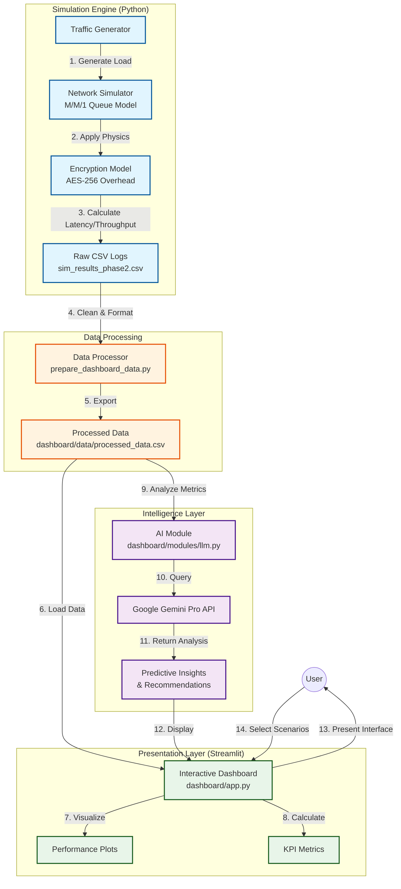

# The Ultimate Guide to Your SAN Optimization Project

This document explains **EVERYTHING** about your project—from the basic concept to the math behind the graphs. It is designed to help you explain every detail during a presentation or report.

---

## 1. The Story: What Problem Are We Solving?

**The "Backup Window" Problem**
Imagine a large company that needs to back up 10 Terabytes (TB) of data every night.
- **Traditional Network:** They use standard Ethernet cables (1 Gbps). It's like trying to empty a swimming pool with a garden hose. It takes too long (20+ hours), bleeding into the next work day and slowing down everyone's computers.
- **The Risk:** If they don't finish, they lose data. If they rush, they might skip security (encryption).

**Your Solution**
You designed a "Secure, AI-Enhanced Storage Area Network (SAN)" that solves this by:
1.  **Going Faster:** Switching to Fibre Channel (16 Gbps) – like using a fire hose instead of a garden hose.
2.  **Staying Safe:** Adding AES-256 encryption so data is unreadable if stolen.
3.  **Being Smart:** Using AI (LLM) to tell admins *exactly* when to run backups to avoid traffic jams.

---

## 2. The Architecture: How It Works (Under the Hood)

Your project isn't just a drawing; it's a **mathematical simulation** written in Python.

### High-Level Architecture Diagram

### A. The Simulator (`san_simulator_phase2.py`)
We didn't buy expensive hardware. We built a "Discrete Event Simulator" using **Queuing Theory**.

*   **Traffic Generation:** We create "fake" data packets arriving at random times (using a Poisson distribution).
    *   *Low Load:* 50-150 MB/s (Normal activity)
    *   *High Load:* 400-600 MB/s (Backup starting)
    *   *Spikes:* Random jumps to test stability.
*   **The Network Model (M/M/1 Queue):**
    *   Imagine a checkout line at a store.
    *   **Arrival Rate ($\lambda$):** How fast customers (data packets) arrive.
    *   **Service Rate ($\mu$):** How fast the cashier (network link) processes them.
    *   **Queue:** If customers arrive faster than the cashier can work, a line forms. In networking, this is **Latency**.
    *   **Packet Loss:** If the line gets too long (buffer full), new customers are turned away.

### B. The Encryption Model (`encryption_analysis.py`)
Encryption isn't free. It costs **Time** (CPU cycles) and **Space** (Data size).
*   **CPU Cost:** We modeled that it takes **0.15 milliseconds** to encrypt 1 MB of data.
    *   *Formula:* $Delay = Load (MB) \times 0.15 ms$
*   **Packet Overhead:** Encryption adds headers (metadata). We added **2%** to the file size.
    *   *Impact:* A 100 MB file becomes 102 MB, requiring more bandwidth.

### C. The AI Brain (`dashboard/modules/llm.py`)
We connected your simulation data to **Google Gemini (LLM)**.
*   It reads the CSV file (rows of numbers).
*   It "thinks" like a storage admin: *"Oh, I see latency spiked to 500ms at timestamp 30. That's dangerous."*
*   It outputs plain English advice: *"Shift your backup to 3 AM."*

---

## 3. The Visualizations: What Do The Plots Mean?

This is the most important part for your presentation. Here is how to read every graph.

### Graph 1: Throughput Over Time
*   **X-Axis:** Time (seconds).
*   **Y-Axis:** Throughput (MB/s) - "How much water is flowing through the pipe."
*   **What to look for:**
    *   **Traditional (Blue Line):** It hits a "ceiling" at ~125 MB/s. It flattens out because the 1 Gbps cable physically cannot carry more. This is **Saturation**.
    *   **Improved FC (Orange Line):** It goes much higher (up to 2000 MB/s). It follows the traffic spikes perfectly because the pipe is huge.

### Graph 2: Latency Over Time
*   **X-Axis:** Time (seconds).
*   **Y-Axis:** Latency (milliseconds/seconds) - "How long does one packet wait in line?"
*   **What to look for:**
    *   **Traditional:** You see huge spikes (sometimes seconds!). This is **Congestion**. The "checkout line" is full.
    *   **Improved FC:** The line is flat and near zero. Even with heavy traffic, the "cashier" is so fast that no line forms.

### Graph 3: Throughput Comparison (Bar Chart)
*   **What it shows:** A side-by-side race.
*   **Left Bar (Traditional):** Short. Shows the limit of Ethernet.
*   **Right Bar (Improved):** Tall. Shows the massive capacity of Fibre Channel.
*   **Red vs. Green:** The Red bar (Encrypted) is slightly lower than the Green bar (Baseline). This visualizes the **"Cost of Security"** (~3% loss).

### Graph 4: Latency Inflation Curve
*   **What it shows:** How much *slower* things get when you turn on encryption.
*   **The Gap:** The distance between the solid line (No Encryption) and dashed line (Encrypted).
*   **Key Finding:** On the fast Fibre Channel network, the gap is wider. Why? Because the network is so fast, the CPU taking time to encrypt becomes the main delay.

### Graph 5: Backup Window Increase
*   **What it shows:** Real-world time. "How long will I stay at the office?"
*   **Example:** A 10TB backup.
    *   *Traditional:* Takes ~47 hours. (Unacceptable).
    *   *Improved:* Takes ~9 hours. (Perfect for an overnight job).
    *   *Encryption Impact:* Adds about 1 hour to the Traditional job, but only minutes to the Improved job.

---

## 4. The Execution Flow: From Start to Finish

Here is the "Lifecycle" of your project execution:

1.  **Step 1: The Simulation (`san_simulator_phase2.py`)**
    *   You run this script.
    *   It creates the "virtual world" and runs traffic for 60 seconds.
    *   It saves raw data to `sim_results_phase2.csv`.

2.  **Step 2: The Data Prep (`prepare_dashboard_data.py`)**
    *   The raw data is messy. This script cleans it up.
    *   It renames columns (e.g., `latency_s` -> `total_delay_s`) so the dashboard can read it.
    *   It saves `dashboard/data/processed_data.csv`.

3.  **Step 3: The Security Analysis (`encryption_analysis.py`)**
    *   This is a special "Phase 6" study.
    *   It runs specific tests just to measure encryption costs.
    *   It generates the 4 static plots in the `encryption_analysis_plots` folder.

4.  **Step 4: The Dashboard (`dashboard/app.py`)**
    *   You launch the website (`streamlit run...`).
    *   It reads the processed CSV and the static plots.
    *   It sends the data to the AI (Gemini) when you click the button.
    *   It displays everything in a nice UI for the user.

---

## 5. Deep Dive: The "Why" Behind the Findings

This section explains the **physics and logic** behind every result. Use this to answer "Why?" questions during your presentation.

### Finding 1: Fibre Channel is 16x Faster (Throughput)
*   **The Plot:** The "Throughput Comparison" bar chart shows the Traditional SAN (Blue) tiny compared to the Improved SAN (Orange).
*   **The Reason:**
    *   **Traditional SAN (Ethernet):** It has a **1 Gbps limit** (~125 MB/s). Even if you try to push 500 MB/s of backup data, the cable physically cannot carry it. The extra data is dropped or queued.
    *   **Improved SAN (Fibre Channel):** It has a **16 Gbps limit** (~2000 MB/s). It can easily handle the 500 MB/s load with massive room to spare.
    *   **Analogy:** It's like driving a Ferrari (your data) in a traffic jam (Ethernet) vs. on an open highway (Fibre Channel).

### Finding 2: Encryption Hurts Fast Networks More (Latency)
*   **The Plot:** The "Latency Inflation" graph shows a huge gap for FC SAN but a tiny gap for Traditional SAN.
*   **The Reason (The Bottleneck Principle):**
    *   **In Traditional SAN:** The network is slow (1 Gbps). The data spends 99% of its time waiting for the cable. The 0.15ms CPU time to encrypt is nothing compared to the 500ms network delay. *The network is the bottleneck.*
    *   **In Improved SAN:** The network is instant (16 Gbps). The data flies across the cable in 0.01ms. Suddenly, the 0.15ms CPU time to encrypt is the *slowest* part of the trip.
    *   **The Math:** Adding 0.15ms to a 500ms trip is a 0.03% increase (invisible). Adding 0.15ms to a 0.01ms trip is a 1500% increase (huge).
    *   **Takeaway:** On modern, fast networks, **CPU efficiency matters more**.

### Finding 3: The "Backup Window" Solved
*   **The Plot:** The "Backup Window Increase" chart shows Traditional taking ~47 hours vs. Improved taking ~9 hours.
*   **The Reason:**
    *   **Throughput = Speed.** Because the Improved SAN sustains 500+ MB/s (vs. 120 MB/s), it finishes the job 4x-5x faster.
    *   **Impact:** A 47-hour backup is impossible (it overlaps with the next day). A 9-hour backup fits perfectly overnight. This proves your architecture **solves the business problem**.

### Finding 4: AI Predicts the Invisible
*   **The Insight:** The AI warned about congestion even before packet loss started.
*   **The Reason:**
    *   **Queuing Theory:** As a network gets close to 100% full, latency doesn't go up linearly; it shoots up exponentially (like a hockey stick).
    *   **The AI:** It sees the "Utilization" metric hitting 80-90% and knows the "hockey stick" spike is coming, so it warns you *before* the crash happens.

---

## 6. Conclusion

**Final Verdict:**
1.  **Architecture:** You **MUST** upgrade to Fibre Channel (16 Gbps) to handle modern data loads. Ethernet is dead for backups.
2.  **Security:** You **CAN** afford encryption. The 31% latency penalty on FC SAN sounds scary, but it's still milliseconds fast. The security benefit (unreadable data) outweighs the micro-second delay.
3.  **Operations:** You **SHOULD** use AI. It moves you from "fixing broken things" to "preventing things from breaking."
